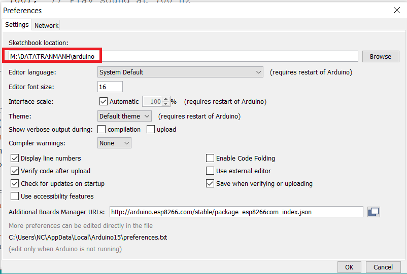
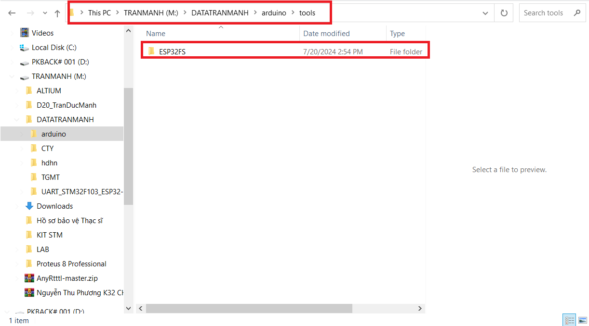

# Quy trình thực hiện.

## Setup Arduino ESP32 filesystem uploader

### 1 Cài đặt ESP32FS

- B1 Tải bộ cài:
	+ Link tải: [ESP32FS]()
	
- B2 Giải nén:

- B3 Cài đặt.
	+ Lấy đường dẫn Arduino đang được cài đặt trên máy.
	

	+ Dán thư mục vừa giải nén vào vị thư mục ** Tools** của Arduino.
	

	
### 2. Upload file HEX cần nạp vào ROM của ESP32.
- B1 Mở File code đã có sẵn.
- B2 Chọn Tool -> ESP32 Sketch Data Upload.
- B3 Nạp code cho ESP32.

	